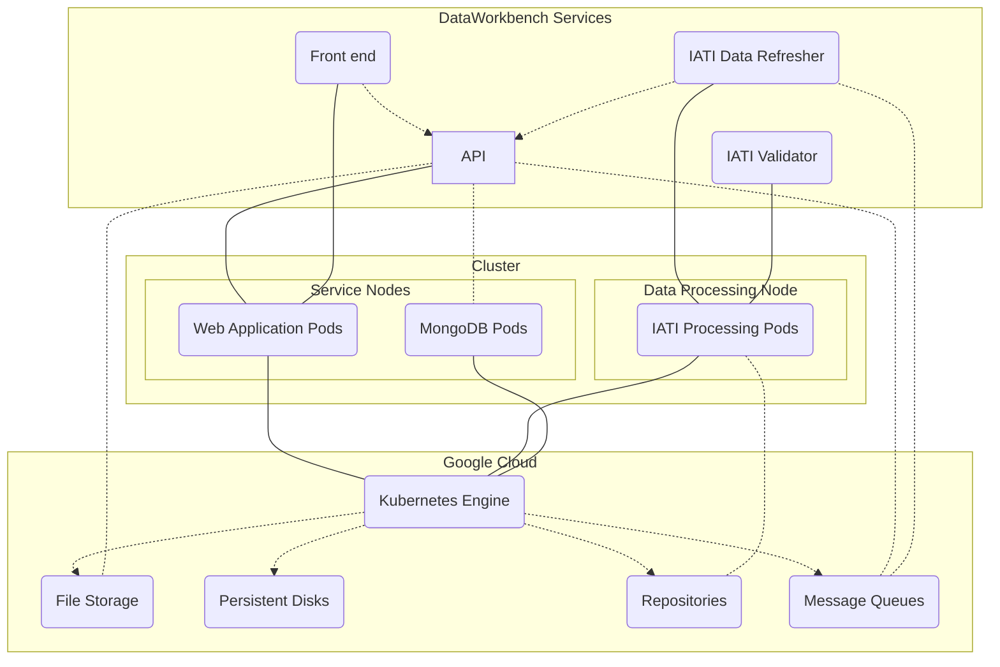

The DataWorkbench consists of applications running as services in containers on a Kubernetes cluster. Applications are grouped in pods that run on the same machine, and can share for instance a local disk.

The current version uses the Google Kubernetes Engine (GKE) to host and manage the cluster, and Google Cloud products to provide storage services and load balancing.

