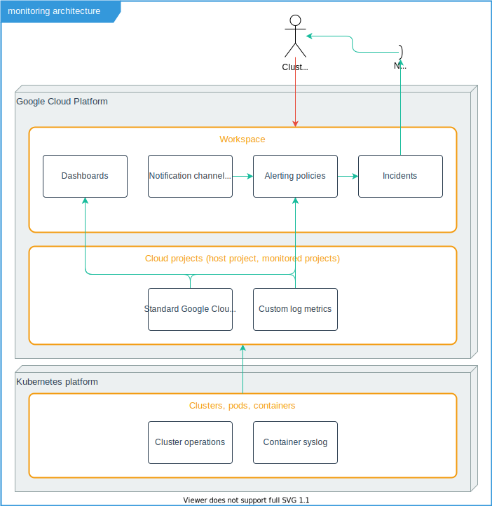

## Google Cloud Monitoring

The monitoring setup consists of several components.

In Google Cloud Platform terms:

* A user (cluster admin) has access to one or more cloud projects, in one or more organisations.
* A workspace consists of a host project and one or more monitored projects, in a single environment. Dashboard charts can be set up across all these cloud projects, to get a single view on for instance all resources used.
* Alerting policies and notification channels are organised per workspace.
* Incidents can be viewed in a workspace. Incidents are managed within the Google Cloud environment, based on alerting policies: if the alert policy would create an alert, an incident is created. Once the alert is "switched off", the incident is considered resolved.
* Incidents can be reported to multiple notification channels: Slack, email, mobile app, etc.
* A dashboard can consist of one or more charts that visualise information gathered from various metrics sources in each of the projects in the workspace.
* Each project has multiple metrics that are provided from a Kubernetes cluster or other Google products associated with the project (storage buckets, for instance). In addition, it can define one or more custom log metrics. We use it to count the occurrence of specific messages indicating the successful completion of cronjobs.

## Managing the monitoring environment

Monitoring and alerting settings can both be exported and imported using `gcloud`.

* All monitoring configuration is in the `/monitoring` directory.
* Actual configurations can be dumped into the `/monitoring/config` directory, and maintained within a deployment branch of the cluster config. This makes it possible to monitor configuration changes that may have to be ported back to more general product branches.
* Scripted deployment is harder, due to timestamps in exported config, identifiers for created objects that need to be referenced in other places. We're not attempting this now.

Running the script `monitoring/config_dump.sh` will create a set of files under `/monitoring/config` that lists the current settings for dashboards, notification channels, alerting policies and custom metrics.