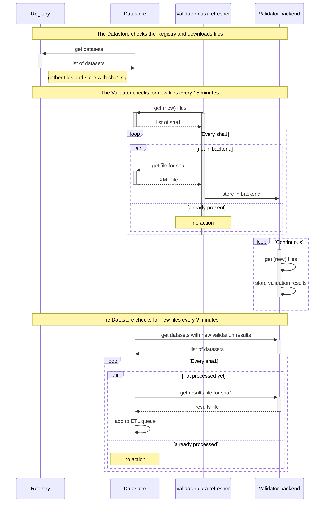

# Integration validator and datastore

```mermaid
sequenceDiagram
	participant Registry
	participant Datastore
	participant ValRefresh as Validator data refresher
	participant Validator as Validator backend
	
	note over Registry, Validator: The Datastore checks the Registry and downloads files
	
	Datastore ->>+ Registry: get datasets
	Registry -->>- Datastore: list of datasets
	
	note left of Datastore: gather files and store with sha1 sig
	
	note over Registry, Validator: The Validator checks for new files every 15 minutes
		ValRefresh ->>+ Datastore: get (new) files
		activate ValRefresh
		Datastore -->>- ValRefresh: list of sha1
		
		loop Every sha1
			alt not in backend
				ValRefresh ->>+ Datastore: get file for sha1
				Datastore -->>- ValRefresh: XML file
				ValRefresh ->> Validator: store in backend
			else already present
				note over ValRefresh: no action
			end
		end
		
		deactivate ValRefresh
	
	Loop Continuous
		activate Validator
		Validator ->> Validator: get (new) files
		Validator ->>- Validator: store validation results
	end

	note over Registry, Validator: The Datastore checks for new files every ? minutes
	
		
		Datastore ->>+ Validator: get datasets with new validation results
		Validator -->>- Datastore: list of datasets

		loop Every sha1
			alt not processed yet
				Datastore ->>+ Validator: get results file for sha1
				Validator -->>- Datastore: results file
				Datastore ->> Datastore: add to ETL queue
			else already processed
				note over Datastore: no action
			end
		end
	
```

